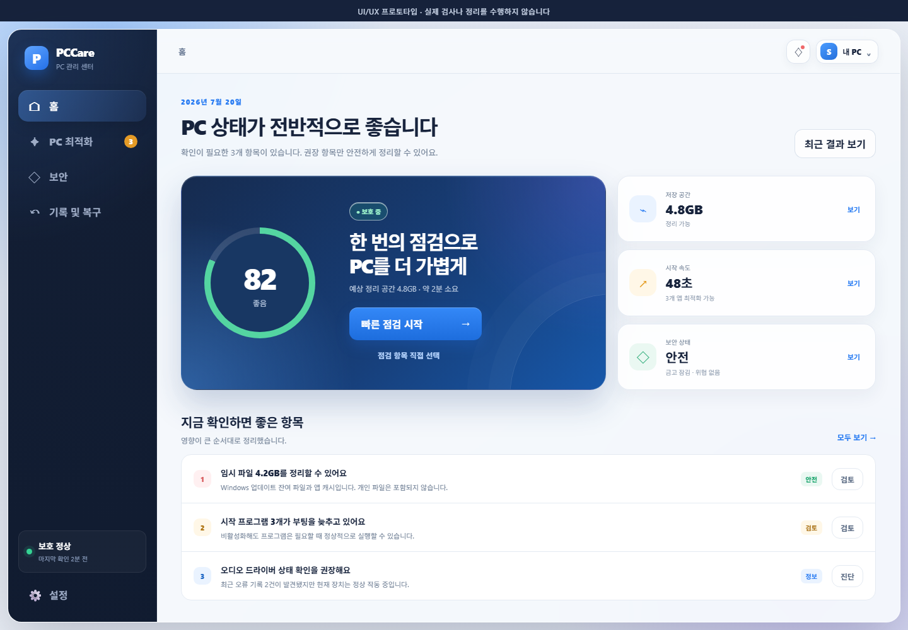

# PC 케어 프로 (PCCare) v51.0.1

Windows PC의 상태 점검, 안전한 정리, 드라이버·오디오 문제 진단, 암호화 금고와 보안 삭제를 한곳에서 제공하는 로컬 PC 관리 프로그램입니다.



## 주요 기능

| 영역 | 제공 기능 |
|---|---|
| PC 최적화 | 빠른·시스템·드라이버·오디오·전체 점검, 진행 단계와 결과 검토 |
| 시스템 케어 | 임시 파일, 브라우저 캐시, 휴지통, 개인정보 흔적, 레지스트리 경로, 바로가기, 시작 프로그램, 서비스, 저장 장치, 네트워크, Windows 보안과 안정성 이벤트 등 57개 검사 항목 |
| 정리와 복구 | 실제 조치가 필요한 항목만 위험도와 함께 표시, 안전 정리, 감사 기록과 되돌리기 |
| 보안 금고 | AstraVault 기반 로컬 암호화 금고, Argon2id 키 파생, 인증 암호화, 복구 코드, 자동 잠금, 무결성 검사 |
| 보안 삭제 | 대상·저장 장치 확인, dry-run 미리보기, HDD 다중 패스 삭제와 감사 기록 |
| 업데이트 보호 | 패키지 매니페스트·SHA-256 확인, 별도 마무리 프로세스, Aegis 무결성·복구 경로 |

## 51.0.1 패치 하이라이트

- 시스템 케어 화면이 좁은 창에서 오른쪽으로 밀리거나 화면 밖으로 넘치지 않도록 반응형 레이아웃을 보강했습니다.
- 보안 금고와 보안 삭제 카드를 공통 디자인 시스템으로 통일하고 텍스트 대비와 좁은 화면 배치를 개선했습니다.
- 통합 점검과 정리 과정의 단계·퍼센트를 단조 증가하는 하나의 진행 흐름으로 통합하고 부드러운 전환을 적용했습니다.
- 검사 실패·불완전한 측정·낮은 신뢰도 결과가 실제 PC 문제나 자동 정리 대상으로 오인되지 않도록 품질 게이트를 추가했습니다.
- DNS 문제는 실제 실패·지연 증거가 있을 때만 정리 후보로 만들며, 서로 다른 로그 줄의 키워드를 잘못 결합하던 추론 오탐을 차단했습니다.
- AI 참고 의견만으로 복구 작업을 만들지 않고 상관된 진단 근거가 있을 때만 복구 후보를 제안하도록 보수적으로 조정했습니다.
- 업데이트 성공과 설치 버전 확인이 끝난 뒤 PCCare가 다운로드한 패키지와 임시 스테이징 파일을 자동 삭제합니다. 사용자가 직접 선택한 외부 파일은 보존합니다.
## 51.0.0 하이라이트

- 홈, PC 최적화, 보안, 기록 및 복구, 설정의 5개 제품 영역으로 전체 탐색 구조를 단순화했습니다.
- macOS의 깊이감, One UI의 큰 정보 단위, Windows 11의 재질·컨트롤 감각을 결합한 공통 디자인 시스템을 적용했습니다.
- 시스템 케어와 통합 점검을 `범위 선택 → 검사 → 결과 검토 → 조치` 흐름으로 통일했습니다.
- 보안 금고의 유지 관리·마이그레이션 도구와 설정의 개발 옵션은 고급 영역으로 이동했습니다.
- 기능과 엔진을 descriptor로 등록하는 모듈 카탈로그를 도입해 새 기능, 엔진, 설치 선택 항목을 기존 셸 수정 없이 확장할 기반을 마련했습니다.
- 정상 시작 중 보류 업데이트가 자동으로 UAC를 띄우고 앱을 종료하던 경로를 제거했습니다. 업데이트 마무리는 사용자가 업데이트 화면에서 명시적으로 시작합니다.
- .NET 10.0.10 계열 패키지와 Windows App SDK 2.2 stable로 런타임 기반을 갱신했습니다.

## 설치와 업데이트

- 설치 파일: GitHub Releases의 `PCCare_Setup_v*.exe`
- 업데이트 파일: `PCCare_Update_v*.spdup`
- 앱의 **설정 → 업데이트 상태**에서 최신 릴리즈를 확인하거나 `.spdup` 파일을 검사한 뒤 적용할 수 있습니다.
- 실행 중인 파일은 별도 마무리 프로세스가 교체하며, 관리자 권한이 필요한 경우 사용자가 **업데이트 마무리**를 누른 시점에만 UAC를 요청합니다.
- 개인 개발자 배포 환경을 고려해 Authenticode 서명을 필수 조건으로 두지 않으며, 릴리즈 SHA-256과 패키지 내부 매니페스트 검증을 사용합니다.

## 개발 기반

- .NET 10 / WinUI 3 / Windows App SDK 2.2 stable
- self-contained Windows x64 배포
- Rust 2024 edition Core 및 Repair Helper
- SQLite 로컬 데이터, JSON Lines 엔진 프로토콜

빌드:

```powershell
.\scripts\build.ps1 -SkipInstaller
```

self-contained 앱 게시:

```powershell
.\scripts\build-app.ps1
```

서명을 생략한 설치·업데이트 패키지 빌드:

```powershell
.\scripts\build.ps1 -SkipTests -SkipSigning
```

## 검증 상태

51.0.1 x64 Release 솔루션 빌드는 **경고 0개 / 오류 0개**로 통과했습니다.

- 시스템 케어·진행률·업데이트 정리·설치 수명주기 집중 테스트: **33 passed / 0 failed**
- 전체 회귀 스위트: **562 passed / 116 skipped**, Aegis 미러 병렬 테스트 1건은 단독 재검사 통과
- Rust workspace release test: 통과
- Core JSON Lines self-test 및 HTML 보고서 생성: 통과
- self-contained 게시 레이아웃·비관리자 실제 실행·시작 로그 milestone: 통과

보류된 테스트는 AstraVault에서 아직 생산용으로 활성화하지 않은 쓰기·마이그레이션 경로를 검증하는 안전 게이트입니다.

## 구조와 확장

| 경로 | 용도 |
|---|---|
| `src/SmartPerformanceDoctor.App/Platform/` | 제품 모듈, 기능, 엔진 카탈로그 |
| `src/SmartPerformanceDoctor.App/Resources/` | PCCare 디자인 토큰과 공통 스타일 |
| `src/` | 앱·서비스·네이티브 엔진 소스 |
| `experimental/SecurityLab/` | 보안 금고·보안 삭제 보강 계층 |
| `tests/` | 단위·계약·회귀 테스트 |
| `scripts/` | 빌드·게시·패키징·검증 스크립트 |
| `docs/ui-prototype/` | 51 UI/UX 프로토타입 |

새 기능과 엔진을 추가하는 방법, 권한 경계와 검증 게이트는 [PCCare 51 아키텍처](docs/architecture/51-modernization.md)에 정리되어 있습니다.

## 런타임 데이터

- 지식 DB: `%LOCALAPPDATA%\SmartPerformanceDoctor\data\knowledge.db`
- 업데이트 상태: `%LOCALAPPDATA%\SmartPerformanceDoctor\updates\`
- Aegis Mirror: `%ProgramData%\AstraCare\AegisMirror\`
- 검사 보고서: 설치 폴더의 `reports\`
